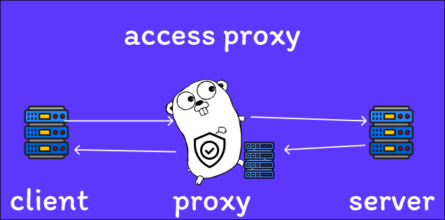

# 🧱 Access Proxy



> Прокси-сервер для защиты трафика, фильтрации доменов, ограничения запросов и гибкой настройки окружения.

---

## 🚀 Цель проекта

Создание настраиваемого **reverse proxy**, который:
- фильтрует домены и HTTP-методы;
- ограничивает частоту запросов;
- поддерживает разные режимы работы (`dev` / `prod`);
- конфигурируется через **YAML** или **CLI-флаги**.

---

## ⚙️ Основной функционал

| Параметр | Описание | Пример |
|-----------|-----------|--------|
| `target` | Целевой URL, куда проксируются запросы | `"http://httpbin.org"` |
| `port` | Порт, на котором запускается proxy-сервер | `8000` |
| `allowed_domains` | Разрешённые IP/домены | `["192.168.215.33", "::1"]` |
| `blocked_methods` | Запрещённые HTTP-методы | `["DELETE", "PATCH"]` |
| `rate_limit_per_minute` | Лимит запросов в минуту | `100` |
| `log_requests` | Логирование запросов | `false` |
| `environment` | Режим окружения (`dev` / `prod`) | `prod` |

---

## 📦 Установка и запуск

### 🔧 Development (локально)
```bash
go build -o bin/access-proxy ./cmd/main.go
./bin/access-proxy --env=dev
```

### 🐳 Production (через Docker)
```bash
docker run --network=host -p 8080:8080 access-proxy     ./access-proxy --env=prod -port 8080 -rate 10 -log true
```

---

## 🧩 Конфигурация

Конфигурация может быть задана **через YAML-файл** или **через CLI-флаги**.  
Приоритет: **флаги > YAML > значения по умолчанию**.

### Пример `config.yaml`
```yaml
target: "http://httpbin.org"
port: 8000
allowed_domains:
  - 192.168.215.33
  - ::1
blocked_methods: 
  - DELETE
  - PATCH
rate_limit_per_minute: 100
log_requests: false
environment: prod
```

---

## ⚙️ CLI-флаги

| Флаг | Тип | Описание |
|------|------|-----------|
| `--target` | `string` | Целевой URL для проксирования |
| `--port` | `int` | Порт запуска прокси |
| `--rate` | `int` | Лимит запросов в минуту |
| `--log` | `bool` | Включить логирование запросов |
| `--domains` | `[]string` | Разрешённые домены/IP |
| `--blocks` | `[]string` | Заблокированные HTTP-методы |
| `--env` | `string` | Режим окружения (`dev` или `prod`) |
| `--config` | `string` | Путь к YAML конфигурации |

---

## 🧠 Принцип загрузки конфигурации

1. Загружается YAML-конфигурация (по умолчанию `config.yaml`).
2. Определяются CLI-флаги на основе значений из YAML.
3. Если флаг передан при запуске — он **переопределяет** YAML.
4. Конфиг объединяется и передаётся в приложение.

---

## 📂 Структура проекта

```
access-proxy/
├── cmd/
│   └── main.go             # Точка входа
├── internal/
│   ├── config/             # Загрузка YAML + флаги
│   ├── proxy/              # Основная логика проксирования
│   └── types/              # Вспомогательные типы (StringSlice и т.п.)
├── bin/                    # Скомпилированные бинарники
├── config.yaml             # Конфиг по умолчанию
└── Dockerfile              # Сборка для продакшена
```

---

## 🧩 Пример запуска с разными режимами

### Dev
```bash
./bin/access-proxy --env=dev --log true
```

### Prod
```bash
./bin/access-proxy --env=prod --rate 50 --port 8080
```

---

## 🧱 Пример работы
```bash
curl -X GET http://localhost:8000/get
```

✅ Разрешённые домены проходят  
🚫 Запрещённые HTTP-методы и IP — блокируются  
⚡ Частота запросов ограничена `rate_limit_per_minute`

---

## 🧾 Лицензия
MIT License © 2025 — Access Proxy Project

---


